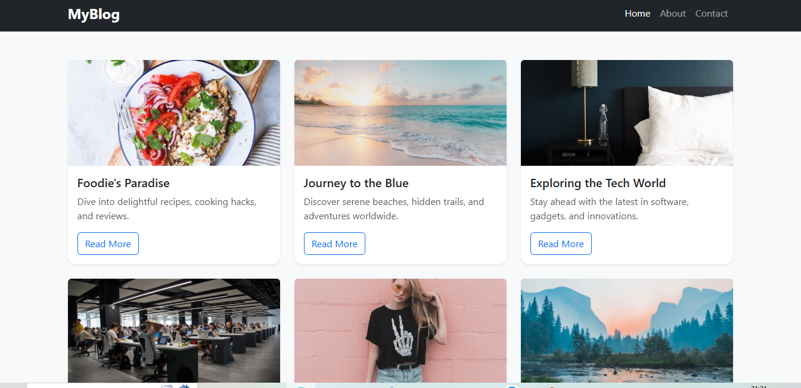
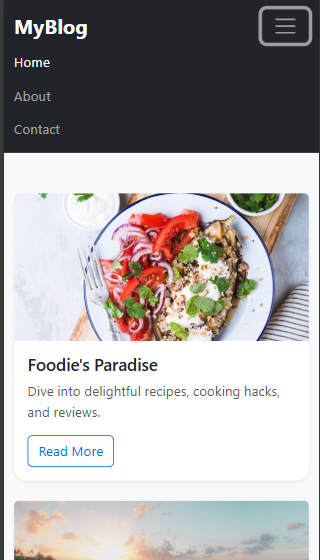

# Modern Bootstrap Blog

A responsive blog layout built using **Bootstrap 5**, featuring a modern card-based design, navbar, footer with social icons, and real Unsplash images.

## 🚀 Features

- Responsive layout using Bootstrap Grid
- 6 modern blog cards with images, title, description, and read more buttons
- Sticky footer with social icons
- Utility classes for spacing and styling
- Mobile-first navigation bar

## 📸 Screenshots

### 🖼️ Home Page Desktop View

### 📱 Mobile View (Collapsed Navbar)

### 💳 Blog Cards

## 🛠️ Tech Stack

- HTML5
- Bootstrap 5 (via CDN)
- CSS (custom styling)
- Bootstrap Icons

---

**Made with 💙 using Bootstrap**

